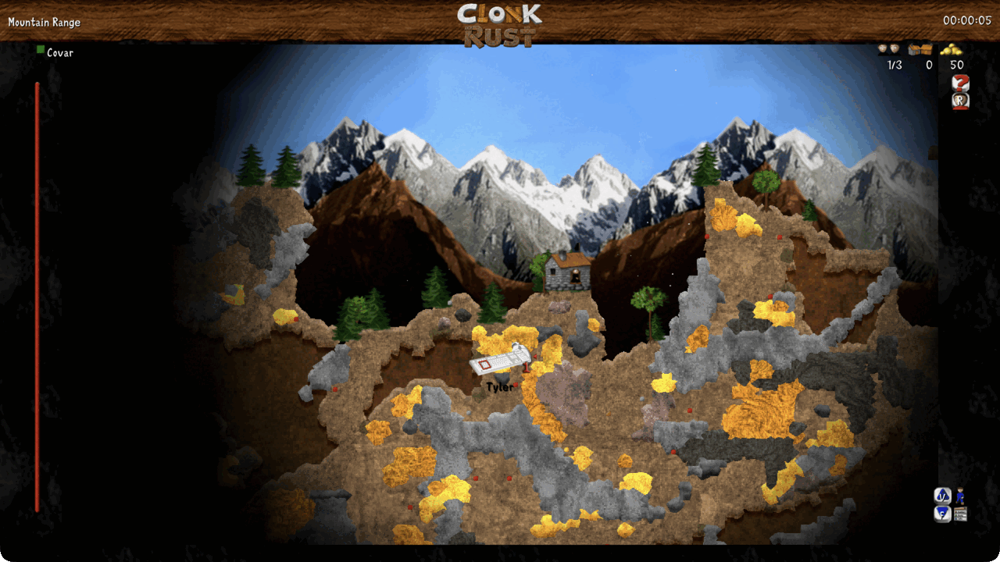
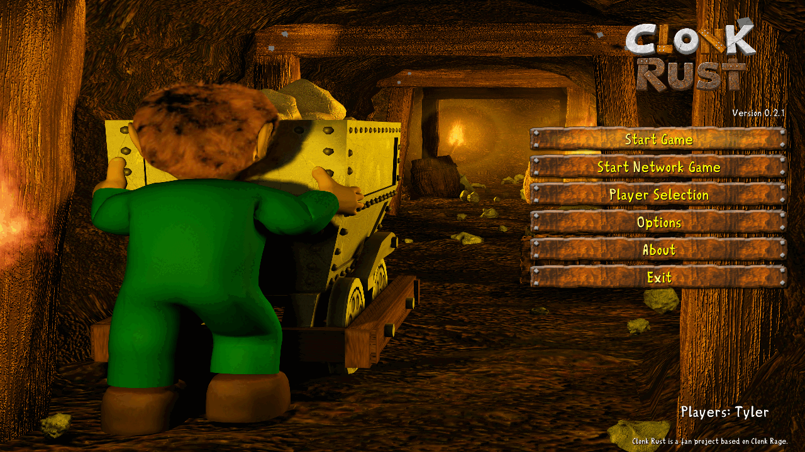
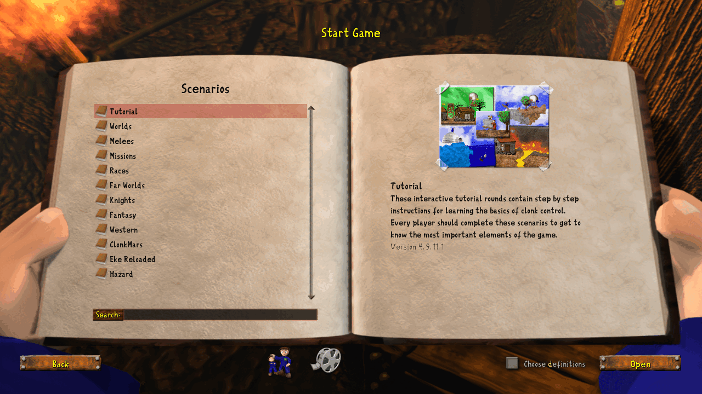

# Clonk Rust

Clonk Rust is a 2D side-view action and strategy game. You command a small crew
of Clonks in a fully destructible landscape: dig for ore and gold, build
settlements and production chains, sail, fly, fight, and blow large holes in the
scenery. Landscapes deform under explosions, water flows, and material falls —
so terrain is a tool as much as a backdrop.



Up to four players can share one keyboard, or play together over LAN and the
internet in lockstep multiplayer.

## Installing

Download the release for your platform from the
[Releases](https://github.com/clonk-org/clonk-rs/releases) page:

| Platform | Asset |
| --- | --- |
| macOS (Apple silicon / Intel) | `.dmg` containing `Clonk Rust.app` |
| Windows | `-setup.exe` installer |
| Linux (x86_64) | `.zip` |

Each download already contains the game data; no separate content install is
needed.

## Playing



Start the game and pick a scenario from the startup menu. What ships with it:

- **Tutorial** — ten scenarios covering movement, digging, construction,
  and combat.
- **Worlds** — settlement scenarios on randomly generated maps, rising in
  difficulty. Mine resources, grow a village, keep the supply chain running.
- **Missions** and **Races** — objective-driven single- and multiplayer maps.
- **Melees** — competitive arenas for local or network play.
- **Themed packs** — Knights, Western, Fantasy, Far Worlds, Hazard,
  Clonk Mars, and Eke Reloaded.



Options cover controls (four keyboard sets and four gamepad sets), graphics
(resolution and scaling), and network settings. The in-game menu holds ten
save-game slots.

Tracker music needs the optional libxmp 4 runtime; install it through your
platform package manager, or point `LC_LIBXMP_LIBRARY` at a compatible library.
Everything else works without it.

MIDI music additionally needs a General MIDI SoundFont, which no platform ships
by default. Put an `.sf2` or `.sf3` bank in `~/Library/Audio/Sounds/Banks` on
macOS, `/usr/share/soundfonts` on other Unix systems, or a `soundfonts` folder
beside the executable on Windows — or name one explicitly through
`SDL_SOUNDFONTS`. FluidSynth 2 provides the synthesis itself and is found the
same way, with `LC_FLUIDSYNTH_LIBRARY` as the override.

## Building from source

The game data lives in a submodule, so clone recursively:

```sh
git clone --recurse-submodules https://github.com/clonk-org/clonk-rs.git
cd clonk-rs
cargo run --release -p clonk-app --bin clonk-app
```

For an existing clone, run `git submodule update --init --recursive` first.
GitHub's generated "Source code" archives do not include submodules and have no
runnable content tree — clone with Git, or use a release download.

To build a distributable package for the current platform:

```sh
cargo xtask package
```

On macOS a release ships one universal `.app`. That needs both architectures
installed (`rustup target add aarch64-apple-darwin x86_64-apple-darwin`); with
only the host one, the command logs a warning and packages a
single-architecture build named after the host triple.

Contributor documentation lives in [`AGENTS.md`](AGENTS.md) and
[`PORT_STATUS.md`](PORT_STATUS.md).

## Licensing

The Rust source in this workspace is available under the MIT license in
[`COPYING`](COPYING). That does **not** relicense the bundled game data:
graphics, audio, scripts, text, and other assets under [`planet/`](planet/) and
the [`content/`](content/) submodule remain under their own `COPYING` files,
including the Clonk content license carried by the content submodule.

The Eke Reloaded and Clonk Mars packs are redistributed under the specific
permission and attribution terms recorded in
[`content/THIRD_PARTY_GAME_CONTENT.md`](content/THIRD_PARTY_GAME_CONTENT.md),
not under the source or general content licenses. Third-party Rust dependencies
retain their own licenses.
