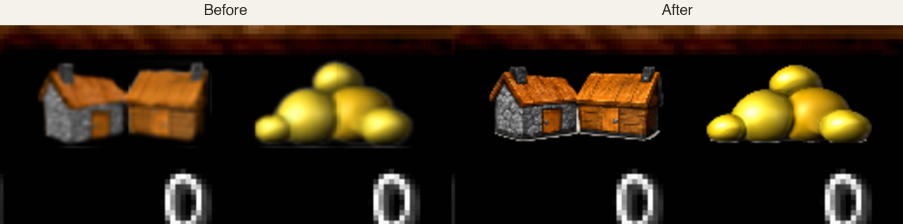
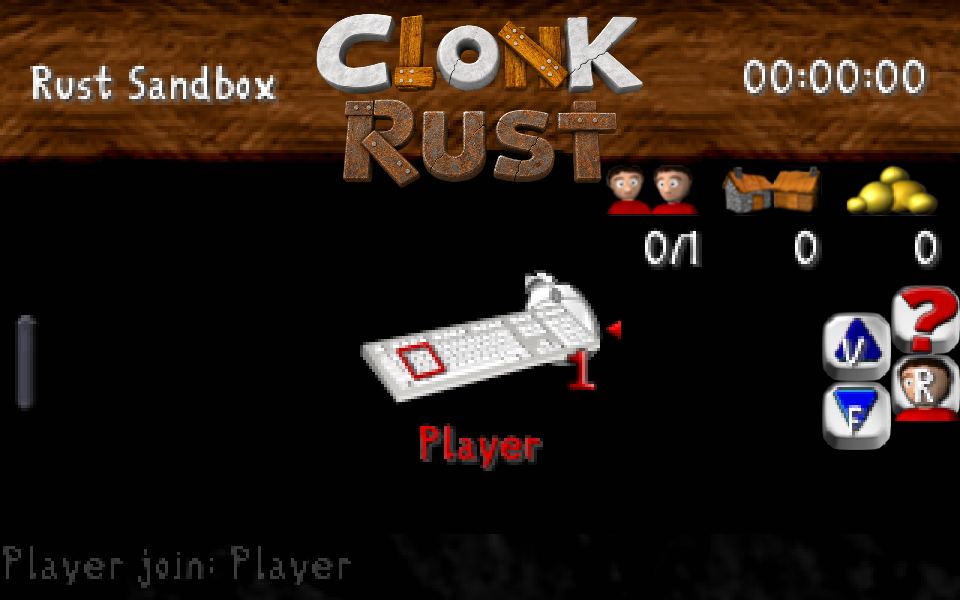
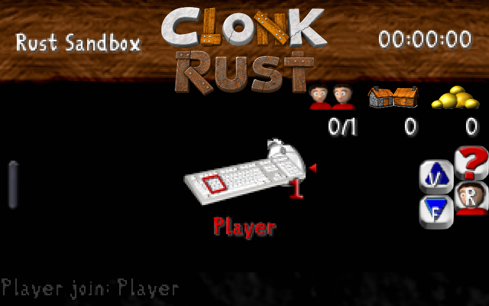

# High-resolution HUD icons

The nine icons in [the batch 2 review](ui-icon-review-batch2/index.html) were
approved for the Clonk Rust HUD. Their originals are the matching standalone
PNGs in `planet/Graphics.c4g`. The four revised previews (Captain,
Construction, Energy, and Player) and both rounds of review are kept in the
review directory.

OpenAI imagegen produced the approved previews. The red Energy bolt was
recolored from the approved blue Magic bolt to keep their shapes identical.
`ui-icon-review-batch2/prepare_runtime.sh` removes the generated backdrop,
retains the original icon's occupied bounds, and writes transparent PNGs at
eight times the original canvas size in `crates/clonk-app/assets/hud-icons`.
The original logical dimensions and HUD positions stay the same.

The Normal game profile replaces an icon only when its source pixels match the
shipped original. Scenario graphics and other custom packs keep their own art.
The replacement is retained through active-scenario loading, owner-color
splitting for the player portrait, software draws, and GPU texture creation.

The screenshots below come from the same running sandbox HUD, rendered by the
game's GPU path at 3× scale. The Score and Wealth icons are visible at the top
right. The full set of original and approved art is shown in the [review
overview](ui-icon-review-batch2/overview.png).

| Original HUD | High-resolution HUD |
| --- | --- |
|  |  |

The original HUD artwork is credited in `planet/Graphics.c4g/COPYING`; the
adaptations are credited and licensed in `crates/clonk-app/assets/COPYING`.
