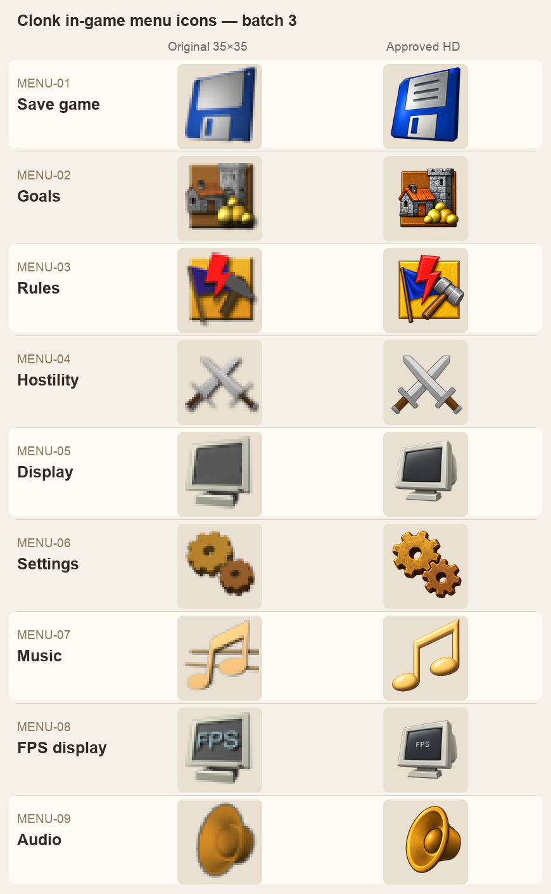
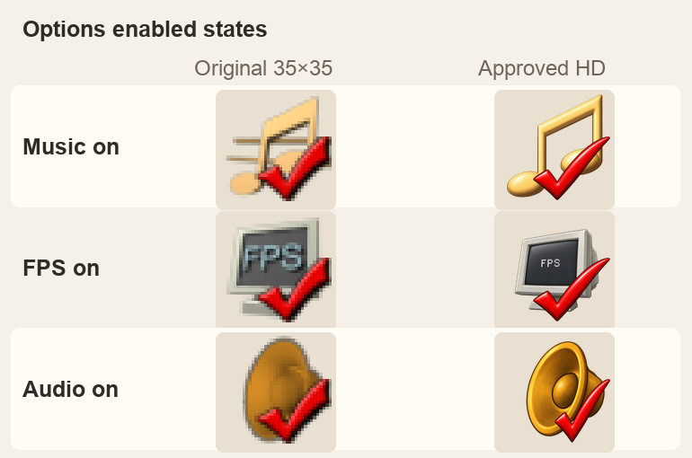

# High-resolution in-game menu and Options icons

The nine icons approved in [batch 3](ui-icon-review-batch3/index.html) replace
their original 35×35 source cells in `Menu.png` and `Options.png`. The approved
Rules icon has square outer plaque corners and keeps the blue flag, red bolt,
and gray hammer. Music, FPS, and Audio each have a matching checked variant,
composed from the approved base and the red mark from the previously approved
UI checkbox.

The existing Options sheet also uses separate checked cells for enabled Music,
FPS, and Audio. The same approved icon appears beneath a red checkmark in each
high-resolution variant:

The comparison above shows the original 35×35 pixels enlarged with nearest
sampling beside the prepared runtime sprites. It is an asset comparison, not
a game screenshot. `ui-icon-review-batch3/prepare_runtime.sh` writes the
transparent 280×280 sprites under `crates/clonk-app/assets/menu-icons/`.
`ImageData` attaches each sprite to its matching source cell, so the menu's
logical geometry and source phase stay the same. The Normal profile installs
the replacements in startup dialogs and active scenarios. Cells with custom
art remain unchanged.

The original source artwork is credited in `planet/Graphics.c4g/COPYING`;
the adaptations and checked variants are credited and licensed in
`crates/clonk-app/assets/COPYING`. The [generation notes](ui-icon-review-batch3/generation-notes.md)
record each revision and the user's approvals.
