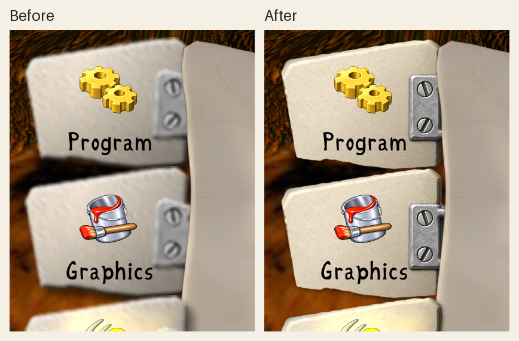

# High-resolution options tab backing

The runtime `crates/clonk-app/assets/StartupTabClipHD.png` is a 960×640 RGBA
adaptation of RedWolf Design's 120×80
`planet/Graphics.c4g/StartupTabClip.png`. It retains the complete paper tab,
two slotted rivets, and right-side loop. The tab is still drawn at 120×80
logical pixels, so icon placement, caption placement, overlap, and hit targets
are unchanged. The source and adaptation use CC BY-NC 4.0; see
`crates/clonk-app/assets/COPYING`.

The selected built-in OpenAI imagegen output is [`generated.png`](generated.png).
Its prompt was:

> Use case: precise-object-edit. Asset type: Clonk game options tab backing
> sprite, 8x super-resolution of the supplied 120x80 RGBA source. Image 1 is
> the EDIT TARGET and authoritative for the COMPLETE object, silhouette,
> relative proportions, and positions. Produce one complete 960x640-class
> high-resolution tab, on genuinely transparent alpha, no background. Keep
> exactly the same composition: horizontal off-white handmade paper/parchment
> tab extending from left to a gray metal hinge on the right, two vertically
> stacked slotted rivets on that hinge, and a curved dark-gray metal loop
> extending from the hinge to the right. Preserve the paper's subtly
> irregular/chamfered outline, near-flat face, gentle warm paper fibers, and
> modest shadow below and right. Improve the clarity of the paper edge,
> metal construction and screw slots, with restrained dimensional shading
> consistent with the original Clonk illustrated UI. The face must remain
> clean and open for a separate game icon at top and text label below; do not
> draw any icon or text. Keep the metal loop's width, overall placement, and
> opening faithful to Image 1; avoid inventing new clamps or extra hardware.
> Render smooth antialiased high-resolution edges without visible 120-pixel
> blocks. Do not crop any part. No checkerboard, backdrop, window, UI mockup,
> gradient canvas, watermark, or extra objects.

The model supplied an opaque backdrop. [`prepare_runtime.py`](prepare_runtime.py)
resizes its selected paper and metal surface to exactly 8× the source, applies
the original silhouette (including the loop opening), removes the old shadow,
and adds a restrained high-resolution shadow. Run it with Pillow installed to
recreate the runtime PNG.

The comparison uses unscaled crops of the application's 3840×2160 GPU
capture at 3× display scaling. Both sides have the same high-resolution icons;
only the tab backing changes. Recreate it with
[`build_comparison.py`](build_comparison.py) and two
`CLONK_HD_OPTIONS_CAPTURE` frames.
