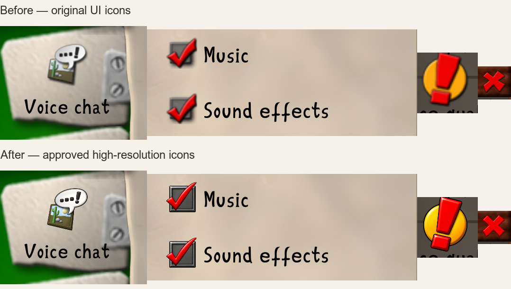
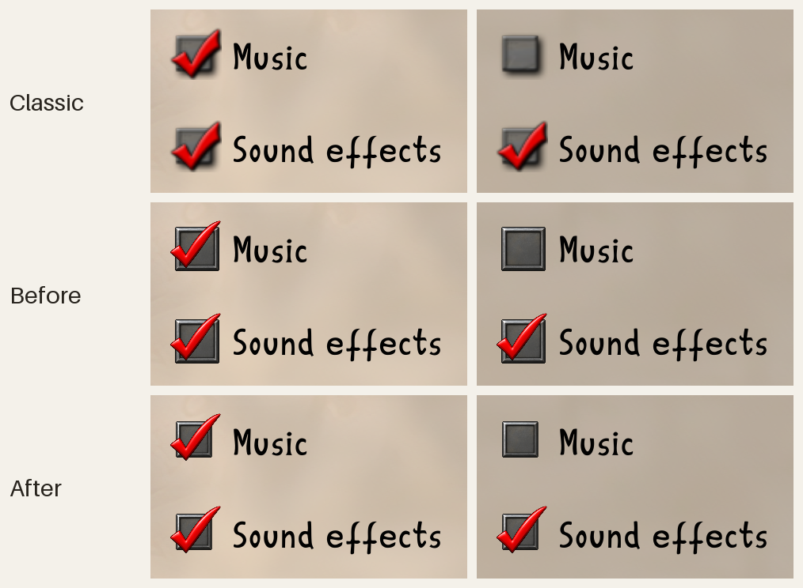
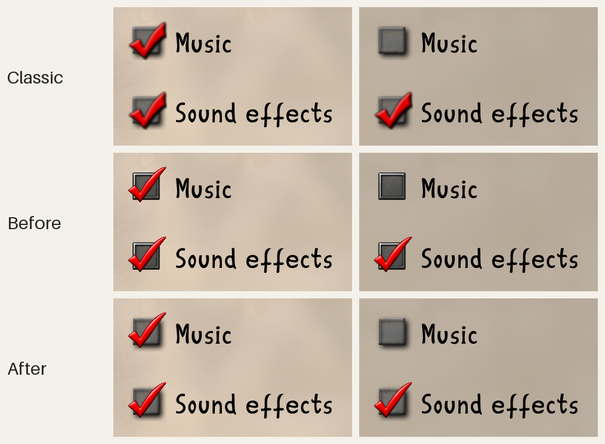

# High-resolution UI icons

Fifteen approved imagegen reconstructions replace the built-in dialog,
file-browser, lobby, Voice-tab, and checkbox artwork. Each runtime source is
256×256 RGBA under `crates/clonk-app/assets/ui-icons/`.

The recording-off and unlocked states were revised from their approved active
counterparts. Recording off is grayscale with no checkmark. The unlocked lock
uses the same rounded body, metal bands and rivets, with an open shackle.
Both checkbox states use the exact same prepared unchecked base and a separate
red checkmark. The disabled checked state desaturates only the checkmark;
uncovered base pixels remain identical. The base is the classic box rebuilt
at 8×; see [Checkbox box](#checkbox-box).

`ImageData` attaches replacements to cells in the original sheets. Facet draws
resolve those cells, including clipped subrectangles, before sampling or GPU
submission. This preserves existing layouts, phase numbers, hit targets, and
unreviewed cells while retaining the full-resolution source. Options, player
selection, one-to-one facets, modulated network rows, and menu-image crops also
resolve the replacement before rasterizing it. The original sheet pixels and
dimensions remain available to legacy consumers.

The application enables the replacements by default in Normal mode. Custom
sheet artwork retains priority; installation matches the shipped source
pixels rather than replacing arbitrary graphics packs. Scenario overrides
continue to replace entire sheets and restore the prepared startup image on
teardown. The explicitly selected LegacyClonk profile and pinned graphics
resources retain their original artwork.

The approved previews were opaque. Runtime preparation removed the connected
beige background (including the closed lock's shackle hole), removed detached
matte fragments, contracted the matte by one source pixel, and reduced with
Lanczos filtering. The approved preview placement determines the runtime
silhouette. Transparent RGB is zeroed before filtering. Checkbox composition
uses the prepared base directly and blends only covered checkmark pixels.

Original artwork: RedWolf Design; `GUIIcons.png` also credits Jonathan Veit
(AniProGuy). The adaptations retain
[CC BY-NC 4.0](https://creativecommons.org/licenses/by-nc/4.0/).
See `planet/Graphics.c4g/COPYING` and `crates/clonk-app/assets/COPYING`.
[Source cells, approved-preview hashes, prompts, and runtime hashes](ui-icon-prompts.json)
record the built-in OpenAI imagegen provenance and approval on 2026-09-22.

[All 15 source comparisons](ui-icons-sprites.png) show the prepared runtime
artwork; this overview is not a game screenshot.

## Native GPU review



These are unscaled crops of the application's retained GPU renderer at
3840×2160 with 3× display scaling, using identical UI state. The before frame
has the new batch disabled; the previously shipped options icons and Wipf
remain enabled in both. The message dialog uses deterministic fixture text.
These are rendered application screens, not generated mockups. They show the
checkbox as approved on 2026-09-22, before the checkbox revisions below.

- [Audio options, full native frame](ui-icons-audio.png)
- [Voice options, full native frame](ui-icons-voice.png)

Regenerate both sides on a machine with a supported GPU:

```sh
CLONK_HD_UI_CAPTURE=/tmp/ui-icon-captures cargo nextest run -p clonk-app \
  -E 'test(approved_ui_icons_reach_scaled_options_and_dialog_gpu_frames)'
```

Without the variable, the test checks retained texture contents and dimensions
without GPU readback. The installed-app regression verifies all approved
sources and both disabled checkbox phases. Frontend coverage checks clipped
sampling and transparent-RGB normalization; asset coverage checks custom-sheet
priority, stable texture identities, and shared checkbox pixels.

## Checkbox box

The checkbox box is the flat classic box of `GUICheckbox.png`, rebuilt at 8×.
It keeps the classic box bounds: x 4–26 and y 5–27 of the classic 32-pixel
cell, x 32–208 and y 40–216 of the 256-pixel one. The approved checkmark spans
the classic checkmark's extent, so it overhangs the box on every side and sits
centred on it, as the classic checkmark does.

[`ui-checkbox/prepare_runtime.py`](ui-checkbox/prepare_runtime.py) prepares the
three checkbox sprites:

- It recovers the approved checkmark layer from the approved pair kept in
  `ui-checkbox/approved/`. The layer's coverage is exact wherever the base is
  not opaque. Where the checkmark's antialiased rim covers the opaque base,
  its coverage is solved from the colour of the nearest solidly covered
  checkmark pixel.
- It rebuilds the classic unchecked box at 8×. The classic cell is a box over
  a pure black drop shadow. The script fits the shadow as a blurred, offset
  box, which gives the box's own coverage and colour. Each edge band keeps its
  colour along the edge, relative to the face, and the face mottling is
  upsampled smoothly. Averaged back over each classic pixel, the rebuilt box
  is within two levels of the classic cell on average.
- It composites the checkmark over the box for the checked state, and the
  checkmark's Rec. 709 luma for the disabled checked state.

### Checkbox revisions

1. **Box bounds** (clonk-org/clonk-rs#1734). The approved base drew a larger
   box, x 27–244 and y 32–247, which left the checkmark above and left of the
   box's centre and covering less of it. Its box was fitted to the classic
   bounds.

   

2. **Flat box** (clonk-org/clonk-rs#1732). The fitted box kept the approved
   base's raised metal bevel, where the classic box is flat. The box is now
   rebuilt from the classic cell.

   

Both are unscaled crops of the Audio options, captured as above. Each Classic
row is the capture's classic side; each Before row is the same capture on the
revision before. `ui-checkbox/build_comparison.py <previous> <current>
<output>` lays out the two capture directories, and
`ui-checkbox/update_overview.py` redraws the checkbox tiles of the sprite
overview from the runtime sprites.
