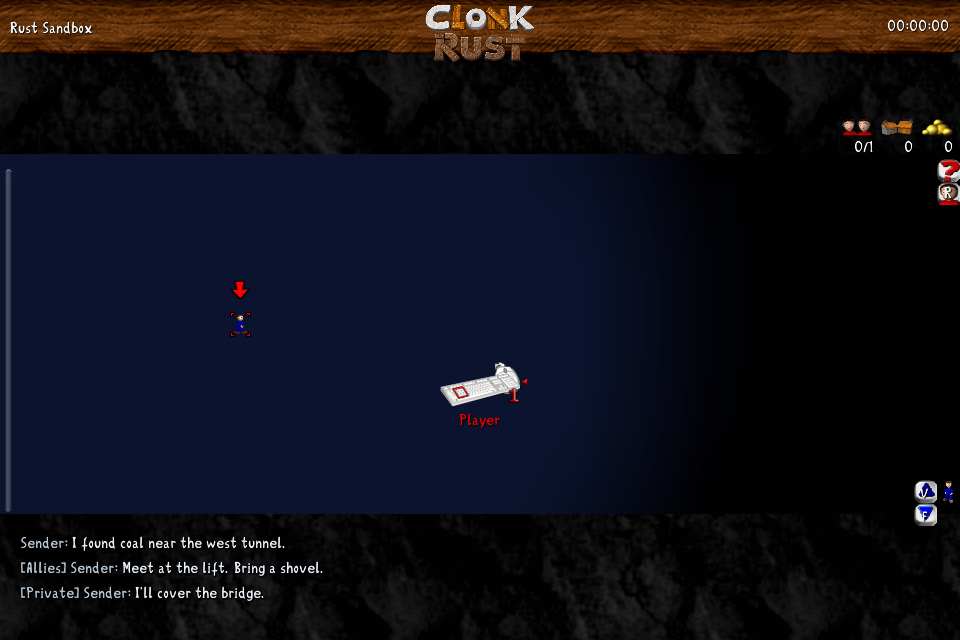
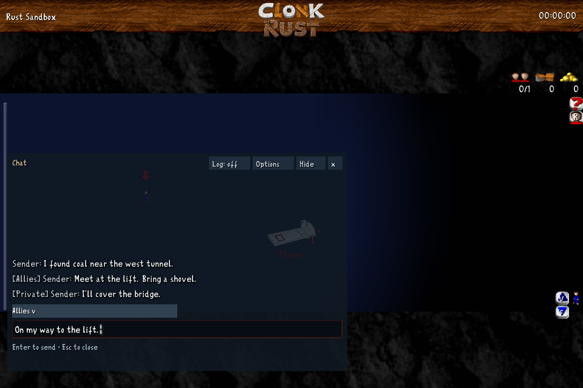

# Enhanced in-game chat

Enhanced chat is the default for normal games, including existing installations
without a saved chat preference. These preferences change local presentation
and input only; messages use the existing game controls and recipient visibility
rules.

The LegacyClonk compatibility profile uses classic chat. In normal games,
**Options → Advanced → Chat → Enhanced** also allows an explicit choice of the
classic interface; that saved choice is respected on later launches.

Press **Enter** or **F2** to open chat. During play, recent messages appear directly
over the game with outlined text and no panel background. Up to six lines remain
visible; each message fades independently over its final two seconds. Long
messages show a two-line preview, with the full text available in history.
Opening chat expands the transcript and composer. **Shift+Enter**
opens allies chat and **Alt+Enter** opens speech above the selected crew.

- Click the recipient label to choose **Everyone**, **Allies**, **Say above crew**,
  or **Private → name**. **Ctrl+Tab** and **Ctrl+Shift+Tab** cycle recipients.
  Explicit commands such as `/team` and `/private` also update the label.
- Press **Enter** to send. **Esc** or **×** closes chat and keeps the draft. Each recipient
  has a separate draft. Select and delete the text to discard it.
- Click **Hide** to close chat and hide incoming message previews. **Enter** or
  **F2** shows chat again, including messages received while hidden. Hiding chat
  keeps the transcript and draft; it does not mute other players.
- **Up/Down** browse messages sent to the selected recipient and restore the
  unfinished draft when returning to the end. Private message bodies stay in
  that recipient's history. **Tab/Shift+Tab** cycle matching player names or commands.
- Scroll over the transcript or press **Page Up/Page Down** to read history.
  Incoming messages preserve the reading position. Click **new messages ↓** or
  press **Ctrl+End** to return to the latest messages.
- Click **Log** or press **Ctrl+L** to include game logs. Recipient
  filtering happens before messages enter the panel.
- **Options** contains **text size**, **history background opacity**, **message
  duration**, and **timestamps**. Preferences are saved with the game's
  configuration. **Esc** first closes Options or the recipient picker.

Pasting never sends a message. Pasted line breaks become spaces for review in
the single-line composer; an oversized paste leaves the current draft intact
and shows an explanation. Failed submissions keep the composer and draft open.
Successful submission means the network worker accepted the message, not that
another player has acknowledged reading it.

The advanced configuration keys are:

```ini
[Chat]
Enhanced=1
TextSize=1
Opacity=85
Duration=12
```

`TextSize` is 0 (small), 1 (medium), or 2 (large). `Opacity` is 40–100 percent.
The opacity setting applies only to the open history panel; previews remain
transparent. `Duration` is 3–60 seconds and affects previews only. Expanded history
remains available until the round ends, within the bounded transcript buffer.

Scenario input prompts continue to use their classic input and callback behavior.

The following captures use the game's sandbox render fixture:




