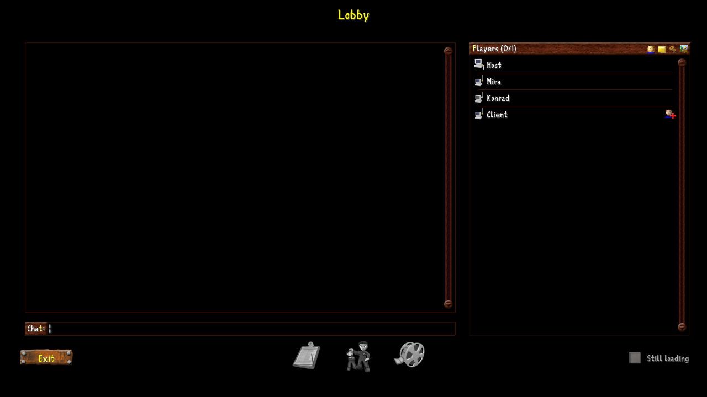
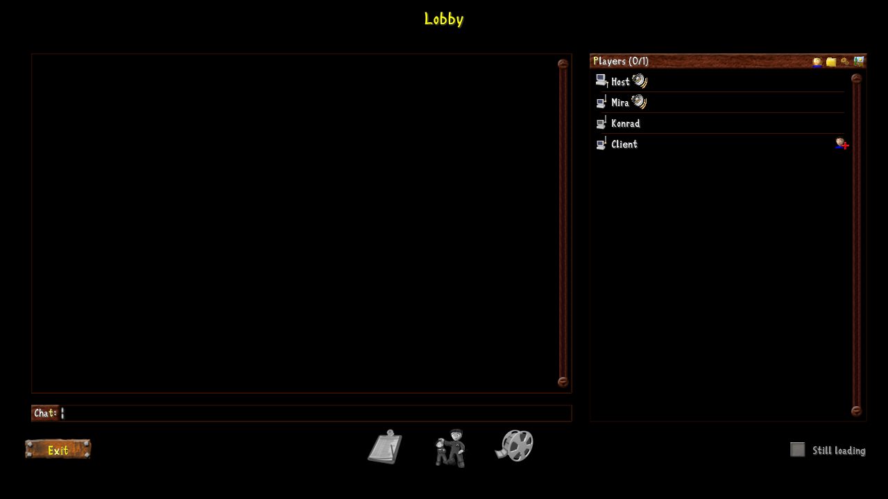
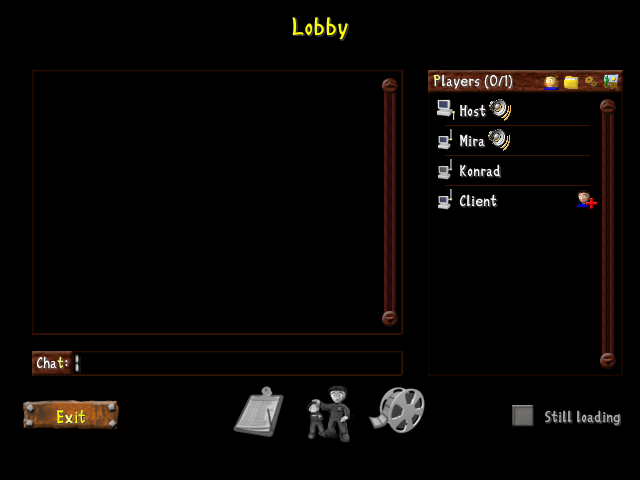
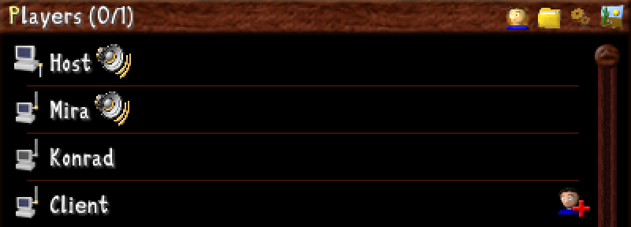

# Lobby speaker icons

These are renders of the joined network lobby from `NetworkLobbyState::render_classic`,
using the game's real artwork. They were made at source commit `39dd82b17` on
2026-09-23 by a throwaway test that is not committed. The participants Host,
Mira, Konrad and Client are fixtures, and Host and Mira are marked as speaking.
The lobby is drawn over black instead of the scenario's loader screen. The
images show the layout; they do not come from a live voice connection.

The speaker is `crates/clonk-app/assets/Speaking.png`. Its attribution and
license are recorded in [the speaking icon notes](../../art/speaking-icon.md).

## Standard window: 1280 × 720, nobody speaking

## Standard window: 1280 × 720, Host and Mira speaking

## Compact window: 640 × 480, Host and Mira speaking

## Roster detail, enlarged 2×

