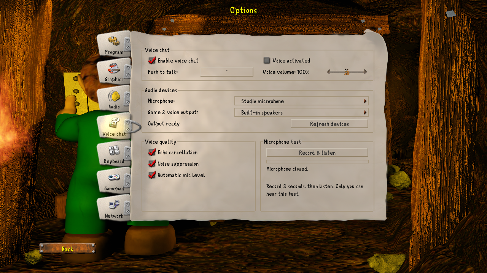
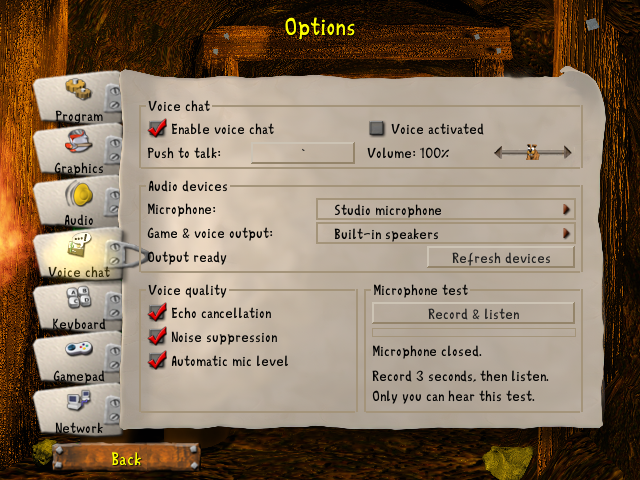

# Voice chat options

Native options-book renders from `voice_page_renders_with_the_options_book_assets`
at source commit `e8e039aae`, captured on 2026-09-22. These use the game's real
menu renderer and artwork with fixture device names; they demonstrate layout,
not a live microphone or output-device connection.

## Standard window: 1280 × 720

## Compact window: 640 × 480

